# Animated GitHub Profile Studio

A desktop visual editor for building animated GitHub profile READMEs from one reusable configuration. Design the profile, preview every theme and motion mode, then export a complete repository-ready bundle.

<p align="center">
  
</p>

<p align="center">
  <a href="https://tfq0.github.io/animated-github-profile/"><strong>Open the Website</strong></a>
</p>

## Highlights

- Seven distinct designs: Quality Control, Classic Terminal, Retro Arcade, Anime HUD, Bento Grid, Signal Poster, and Custom Canvas.
- Live GitHub-style preview with dark/light and animated/static controls.
- Editable identity, headline, terminal sequence, workflow, projects, skills, links, media, sections, colors, typography, and footer.
- Constrained composition, spacing, alignment, panel, workflow, and decorative-shape controls.
- Optional import of public GitHub repository metadata without login or a token.
- Local autosave of the last valid configuration.
- Versioned configuration import/export with automatic v1 and v2 migration.
- Direct download of the currently previewed SVG.
- Deterministic ZIP export containing everything needed for a profile repository.
- Reduced-motion fallbacks and dark/light theme selection in the generated README.
- Agent access through WebMCP tools that read or stage the same configuration used by the editor.

## Create a profile

1. Open the [Website Studio](https://tfq0.github.io/animated-github-profile/) or run it locally.
2. Choose a design, start with a blank profile, or load the clearly labeled fictional sample.
3. Customize the profile content and desktop composition.
4. Review the dark/light and animated/static previews.
5. Resolve validation errors and inspect any design warnings in the Export step.
6. Select **Save SVG** for one header or **Download ZIP** for the complete profile.
7. Upload the generated `README.md` and `assets/` directory to the public GitHub repository named exactly like your username.

Keep the exported `profile.config.json`. Importing it later restores the editable profile without requiring manual SVG changes.

## Exported bundle

| File | Purpose |
| :--- | :--- |
| `README.md` | Generated GitHub profile content and theme/motion image selection |
| `profile.config.json` | Reusable, editable source configuration |
| `SETUP.md` | Profile-specific publishing instructions |
| `assets/profile-header-dark.svg` | Dark animated desktop header |
| `assets/profile-header-light.svg` | Light animated desktop header |
| `assets/profile-header-dark-static.svg` | Dark reduced-motion desktop header |
| `assets/profile-header-light-static.svg` | Light reduced-motion desktop header |

Structured remote media remains referenced by HTTPS URL. It is not copied into the ZIP or embedded in the generated header.

## Customization model

`ProfileConfig` is the single source of truth for the editor, preview, README, SVGs, saved draft, and ZIP.

| Area | Available controls |
| :--- | :--- |
| Design | Template, composition, content order, spacing, panel system, background pattern, console style, text alignment |
| Hero | Headline, command, status checks, animation timing, workflow labels and shapes, footer labels |
| Content | About text, repositories, skills, links, custom Markdown, structured images and GIFs |
| Appearance | Curated system font stacks, dark/light palettes, corner radius, decorative shapes |
| Output | Theme, motion mode, standalone SVG, full ZIP, configuration import/export |

Applying a design changes the visual system without replacing profile content. Loading a complete sample is a separate confirmed action because it replaces the current content.

## Local development

Requirements:

- Node.js `^22.13.0` or `>=24.0.0`
- npm

Install dependencies and start the development server:

```bash
npm ci
npm run dev
```

Open `http://localhost:4173/` in a desktop browser.

Run the complete verification pipeline:

```bash
npm run typecheck
npm test
npm run build
```            
```
