<!-- TFQ0 / Quality Control. Upload this README and the assets directory together. -->
<picture>
  <source media="(max-width: 600px) and (prefers-reduced-motion: reduce) and (prefers-color-scheme: dark)" srcset="./assets/tfq-control-center-mobile-dark-static.svg">
  <source media="(max-width: 600px) and (prefers-reduced-motion: reduce) and (prefers-color-scheme: light)" srcset="./assets/tfq-control-center-mobile-light-static.svg">
  <source media="(prefers-reduced-motion: reduce) and (prefers-color-scheme: dark)" srcset="./assets/tfq-control-center-dark-static.svg">
  <source media="(prefers-reduced-motion: reduce) and (prefers-color-scheme: light)" srcset="./assets/tfq-control-center-light-static.svg">
  <source media="(max-width: 600px) and (prefers-color-scheme: dark)" srcset="./assets/tfq-control-center-mobile-dark.svg">
  <source media="(max-width: 600px) and (prefers-color-scheme: light)" srcset="./assets/tfq-control-center-mobile-light.svg">
  <source media="(prefers-color-scheme: dark)" srcset="./assets/tfq-control-center-dark.svg">
  <source media="(prefers-color-scheme: light)" srcset="./assets/tfq-control-center-light.svg">
  
</picture>

<p align="center">
  <a href="#selected-work">Selected work</a> &nbsp; / &nbsp;
  <a href="#toolbox">Toolbox</a> &nbsp; / &nbsp;
  <a href="#open-source">Open source</a>
</p>

## Beyond the green checkmark.

I'm **Talal**, a Software Test Engineer and independent developer. I work across UI automation, API testing, and backend development—connecting how software is built with how it behaves in the real world.

I like reproducible bugs, useful automation, readable code, and tools that stay open.

```text
inspect  →  reproduce  →  automate  →  improve
```

## Selected work

| Project | What it does | Focus |
| :--- | :--- | :--- |
| **[tfq0seo](https://github.com/TFQ0/tfq0seo)** | A command-line SEO analyzer with site crawling and report generation. | Python · CLI tooling |
| **[tfq0tool](https://github.com/TFQ0/tfq0tool)** | Extracts text from documents, data files, and source code. | Python · Automation |
| **[ksaa-api-tool](https://github.com/TFQ0/ksaa-api-tool)** | A browser-based interface for exploring Falak API endpoints. | API testing · Developer tooling |

<!-- Add other projects when their public repositories are ready to share. -->

## Toolbox

**Testing**  
`Playwright` `Cypress` `Bruno` `Postman` `JMeter`

**Development**  
`Python` `TypeScript` `JavaScript` `FastAPI` `PostgreSQL`

**Environment & delivery**  
`Git` `GitHub Actions` `Docker` `Linux`

## Open source

I enjoy understanding a project before changing it: reproduce the problem, trace the cause, make a focused change, and verify the result.

[Pull requests](https://github.com/pulls?q=is%3Apr+author%3ATFQ0) &nbsp; / &nbsp; [Issues](https://github.com/issues?q=is%3Aissue+author%3ATFQ0) &nbsp; / &nbsp; [Repositories](https://github.com/TFQ0?tab=repositories)

---

<p align="center">
  <sub><b>No monopoly. Yes to open source.</b><br>Build it. Break it. Test it. Improve it.</sub>
</p>
